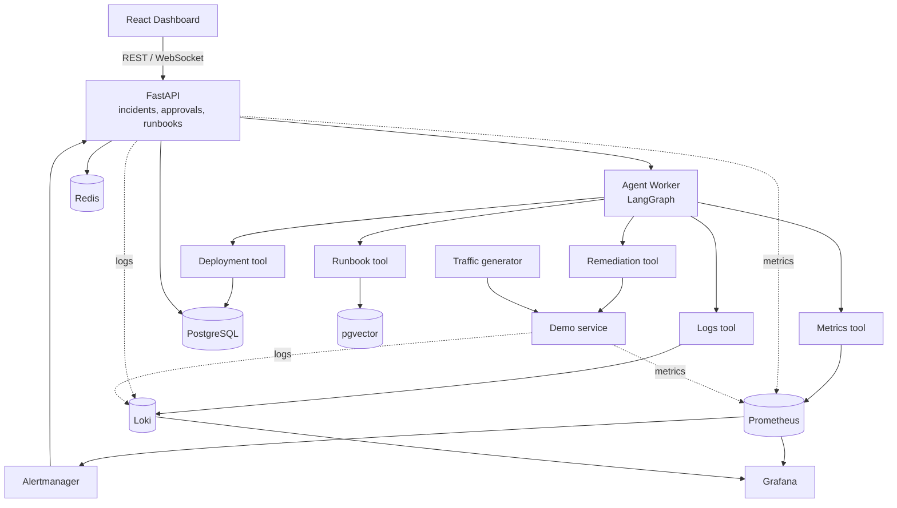

# AI Incident Response Copilot

An incident-response assistant that investigates production alerts the way an on-call engineer
does — pull metrics, search logs, check what shipped recently, read the runbook — then proposes a
root cause **with citations** and waits for a human to approve anything that changes the system.

The interesting constraint is not "can an LLM guess the cause." It is: **can it be trusted with
production access?** This project answers that with three mechanisms — evidence grounding, an
enforced approval gate, and a measured evaluation suite that compares the agent against a
rule-based baseline.

[](https://github.com/Ltuan126/AI-Incident-Response-Copilot/actions/workflows/ci.yml)

---

## What it looks like

Prometheus fires: `checkout-api` error rate went from 1% to 35%.

The Copilot investigates and reports:

```
Probable root cause
  Deployment v1.4.2 introduced a database connection leak.
  Confidence: 87%

Evidence
  ev_metric_12   error_rate 0.01 -> 0.35 starting 14:32
  ev_metric_18   db_connections_active 6 -> 49 of 50
  ev_log_34      "database connection timeout after 5000ms" x412
  ev_deploy_09   v1.4.1 -> v1.4.2 deployed 14:28 by ci-bot
  ev_runbook_02  checkout-api / database_connection_exhaustion

Recommended action
  rollback checkout-api  v1.4.2 -> v1.4.1   risk: medium

Status
  Waiting for human approval.
```

Every line under *Evidence* is a row the agent actually fetched. If the tools come back empty, the
agent is required to say `Insufficient evidence to determine a reliable root cause` rather than
invent a plausible story.

---

## Project status

This is built in weekly increments against a written spec. Being explicit about what exists keeps
the claims in this README honest.

| Area | Status |
| --- | --- |
| Alert ingestion + incident correlation | **Done** |
| Incident timeline and list/detail APIs | **Done** |
| Demo checkout service with five fault modes | **Done** |
| Incident simulator (4 scenarios + recover) | **Done** |
| Docker Compose stack (Postgres, Redis, Prometheus, Loki, Grafana) | **Done** |
| Prometheus instrumentation of the Copilot itself | **Done** |
| Automatic detection (traffic, Prometheus rules, Alertmanager webhook) | **Done** |
| CI: ruff, mypy strict, pytest, image build, stack smoke test | **Done** |
| Prometheus / Loki / deployment connectors | Planned — week 2 |
| LangGraph agent, runbook RAG, evidence grounding | Planned — week 3 |
| Human approval gate + simulated remediation | Planned — week 4 |
| Evaluation suite and rule-based baseline | Planned — week 5 |
| React dashboard | Planned — week 4 |

See [docs/ROADMAP.md](docs/ROADMAP.md) for the full six-week plan.

**No evaluation numbers are published yet.** The thresholds in
[docs/EVALUATION.md](docs/EVALUATION.md) are targets the project must hit before any accuracy
claim appears here.

---

## Architecture



The agent is a **stateful graph**, not a prompt loop. It collects evidence, generates hypotheses,
validates that every hypothesis cites evidence, proposes an action, and then — if the action
mutates anything — checkpoints and stops. A human decision resumes it from that checkpoint.

Full detail in [docs/ARCHITECTURE.md](docs/ARCHITECTURE.md).

---

## Quickstart

Requires Docker and Docker Compose.

```bash
git clone https://github.com/Ltuan126/AI-Incident-Response-Copilot.git
cd AI-Incident-Response-Copilot
cp .env.example .env
docker compose up --build -d
```

Apply the schema and seed baseline data:

```bash
docker compose exec api alembic upgrade head
```

```bash
docker compose exec api python scripts/seed_data.py
```

| Service | URL |
| --- | --- |
| API docs | http://localhost:8000/docs |
| API metrics | http://localhost:8000/metrics |
| Demo checkout service | http://localhost:8001/checkout |
| Prometheus | http://localhost:9090 |
| Alertmanager | http://localhost:9093 |
| Grafana | http://localhost:3000 |
| Loki | http://localhost:3100 |

### Trigger an incident

```bash
curl -X POST http://localhost:8000/api/v1/simulator/incidents/deployment-regression
```

This only flips the demo service into a regressed `v1.4.2` and records the deployment. The bundled
traffic generator keeps calling `/checkout`; Prometheus detects the resulting error rate and
Alertmanager sends the alert to the Copilot. After roughly 30–60 seconds, inspect the incident:

```bash
curl "http://localhost:8000/api/v1/incidents?service_name=checkout-api"
```

Put the service back to normal:

```bash
curl -X POST http://localhost:8000/api/v1/simulator/recover
```

---

## Running without Docker

```bash
python -m venv .venv && .venv/Scripts/activate && pip install -e ".[dev]"
```

You still need Postgres reachable at `DATABASE_URL`. Then:

```bash
alembic upgrade head && uvicorn apps.api.app.main:app --reload
```

Tests run against in-memory SQLite and need no services at all:

```bash
pytest
```

---

## Safety model

The agent can propose anything. It can *execute* almost nothing.

- **Allowlist.** Only `simulated_restart`, `simulated_rollback`, `simulated_scale` and
  `create_incident_note` are executable. Shell access, SQL execution, secret modification and
  log deletion are not tools the model can reach.
- **Enforcement in the tool layer, not the prompt.** A mutating tool checks that a matching
  approval exists, belongs to this agent run, has not expired, and has not been tampered with.
  A system prompt asking nicely is not a security control.
- **Approval integrity.** The backend hashes `action_type + service_name + parameters +
  agent_run_id` when the approval is created and re-checks that hash at execution time, so the
  action a human approved is the action that runs.
- **Blast radius.** In this MVP, remediation only touches the bundled demo service. There is no
  path to a real Kubernetes cluster.

Details and the threat model in [docs/SAFETY.md](docs/SAFETY.md).

---

## Repository layout

```
apps/
  api/          FastAPI: incidents, alerts, approvals, simulator
  worker/       LangGraph agent — graph, nodes, prompts, policies
  web/          React dashboard
packages/
  connectors/   Prometheus, Loki, deployment and runbook data sources
  evaluation/   Datasets, scorers, eval runner
  shared/       Cross-cutting schemas and logging
services/
  demo-checkout-service/   The service the Copilot investigates
migrations/     Alembic
runbooks/       Markdown runbooks ingested into pgvector
infra/          Prometheus, Grafana, Loki and Docker configs
scripts/        Seeding and incident simulation
```

---

## Development

```bash
ruff check . && ruff format --check . && mypy apps packages && pytest
```

CI runs the same checks, builds both images, and smoke-tests the Compose stack end to end.

Further reading:

- [docs/ARCHITECTURE.md](docs/ARCHITECTURE.md) — components, agent graph, incident lifecycle
- [docs/API.md](docs/API.md) — endpoint reference
- [docs/SAFETY.md](docs/SAFETY.md) — allowlist, approval integrity, threat model
- [docs/EVALUATION.md](docs/EVALUATION.md) — dataset, metrics, thresholds, baselines
- [docs/ROADMAP.md](docs/ROADMAP.md) — six-week delivery plan

---

## Design decisions worth arguing about

**Why a rule-based baseline?** Because "error rate rose within 15 minutes of a deployment →
deployment regression" catches a large share of real incidents with zero tokens and zero latency.
The agent has to *beat* that to justify its cost. The evaluation suite measures both.

**Why not let the agent remediate automatically?** Confidence scores are not calibrated well
enough to bet production on, and a wrong rollback during an incident makes things worse. The
approval gate is the product, not a limitation of it.

**Why is the LLM behind an adapter?** So the graph, the tools and the evaluation harness never
import a vendor SDK. Swapping providers should be a config change, not a refactor.
